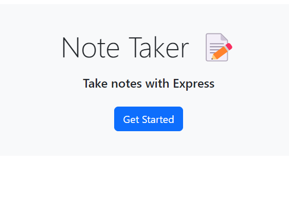
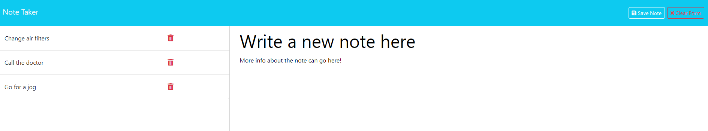

# Note-Taker-App 

## Description

Never forget another important to-do with the Note Taker app (brought to you by express.js and heroku)! With a clean, lightweight interface, our application provides a straightforward and clear interface to store your notes, write new notes, and remove those you have already accomplished. No frills here!

## Table of Contents

-[Installation](#installation)
  
-[Usage](#usage)
  
-[License](#license)
  
-[Contributions](#how-to-contribute)

-[Credits](#credits)

## Installation

No installation is necessary! This application is deployed to Heroku and can be found by following [this link](https://ancient-garden-99710-89b5f14cfbed.herokuapp.com/).

## Usage

Our application is designed to be minimalistic and highly intuitive. After navigating to the homepage, simply click the "Get Started" button to...get started!

On the next screen, you will be greeted with any notes you have created before on the left and an area in the center of your screen to write a new note to add to your list. If at any time you wish to return to the home screen, simply click the button in the top left corner of your screen titled "Note Taker".

To add a new note, type in a title in the section that says "Note Title", and a description or clarification in the text box below it ("Note Text").

After typing in either section, a red button labeled "Clear Form" will appear at the top right of your screen. Click this when it is present to wipe the text you have typed and start fresh. After typing in BOTH sections, a white button labeled "Save Note" will appear next to the red button. Clicking here will add your note to the list (which will show up on the left side of the screen). It's as easy as that!

Done with a task or just don't want to look at it anymore? No problem - click the red trash can icon on that note and it will be gone forever!

Watch the video below for an overview of the project.

[Demonstration video](https://watch.screencastify.com/v/vsWwh4HsNbFYrEOnesua)

## License

[This project uses the following license: MIT](https://opensource.org/licenses/MIT)

## How to Contribute
  
Please contact me on github or through my email listed below if you have any ideas or want to help extend my project!

## Questions

[Please follow this link to my GitHub profile!](https://github.com/kurtriecken)

For any additional questions, please [email me here.](mailto:kurt.riecken@gmail.com)

## Credits
  
[Kurt Riecken](https://github.com/kurtriecken)